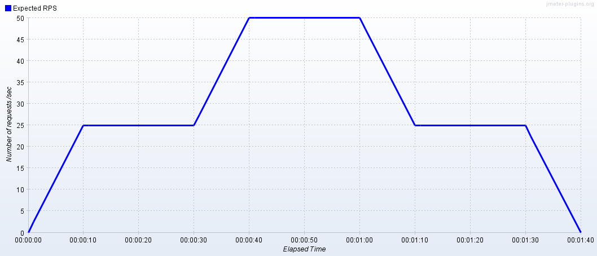
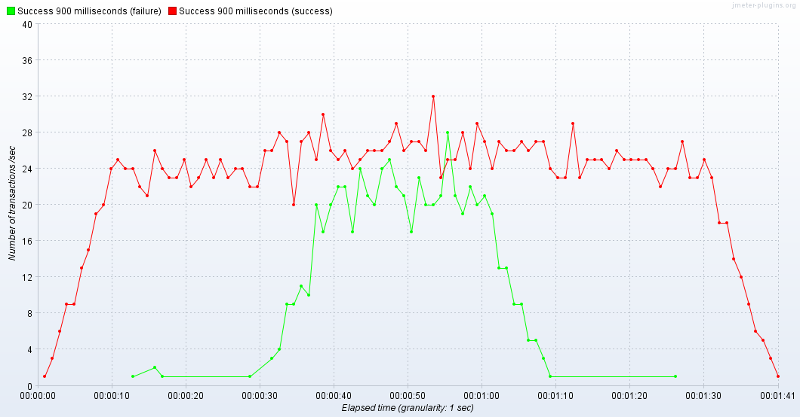
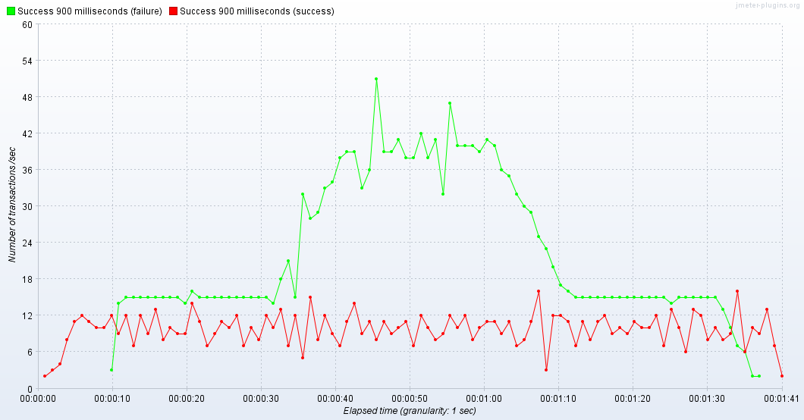

# Choosing the bulkhead implementation: hystrix vs resilience4j

Feature | Hystrix | Resilience4j
------- | ------- | ------------
Bulkhead pattern implementation | Y | Y
Integration with Spring Boot 2 | with the help of `spring-cloud-starter-netflix-hystrix` | Y
Integration with WebFlux (Reactor) | integrated with JavaRX | Y
Prometheus metrics | ? | N ( meaningful metrics exposed just for CircuitBreaker) 
Configure bulkhead within application.yml from the box | with the help of `spring-cloud-starter-netflix-hystrix` | N (applicable for Ratelimiter and CircuitBreaker only)
Amount of transitive dependencies | `com.netflix.archaius:archaius-core:0.4.1`, `io.reactivex:rxjava:1.2.0`  | low (something like `io.vavr:vavr:0.9.2`)

# Resilience4j

## Test Plan



## Bulkhead
### Example: max 25 concurrent request



### Exception count metrics
```
http_server_requests_seconds_count{exception="BulkheadFullException",method="GET",status="500",uri="/hello/{api}",} 645.0
http_server_requests_seconds_sum{exception="BulkheadFullException",method="GET",status="500",uri="/hello/{api}",} 0.457094154
http_server_requests_seconds_max{exception="BulkheadFullException",method="GET",status="500",uri="/hello/{api}",} 0.0
```

## RateLimiter
### Example 10 requests per seconds



### Exception count metrics
```
http_server_requests_seconds_count{exception="RequestNotPermitted",method="GET",status="500",uri="/hello/{api}",} 418.0
http_server_requests_seconds_sum{exception="RequestNotPermitted",method="GET",status="500",uri="/hello/{api}",} 838.681654162
http_server_requests_seconds_max{exception="RequestNotPermitted",method="GET",status="500",uri="/hello/{api}",} 2.065762051
```


# Hystrix
