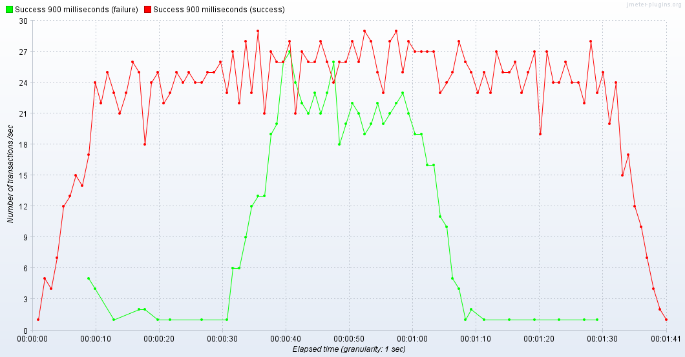
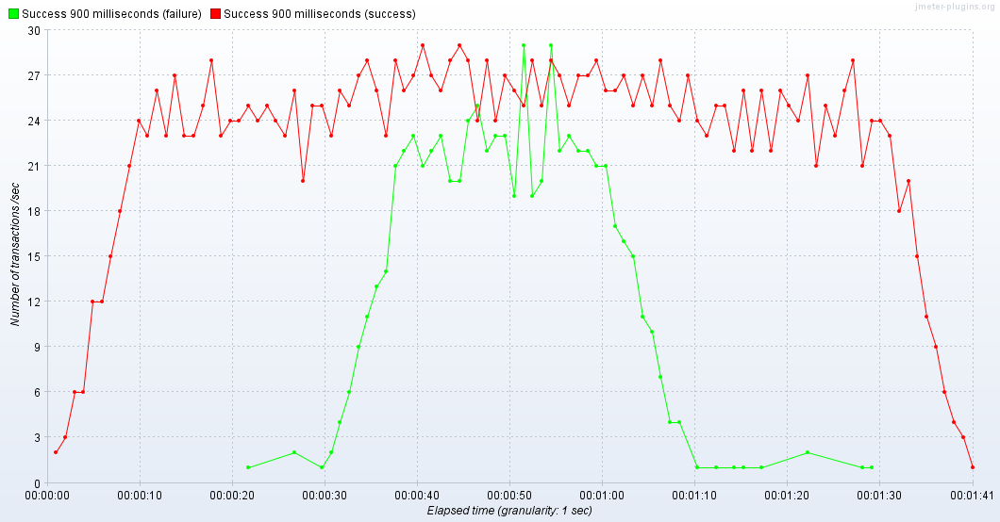

# Choosing the bulkhead implementation: hystrix vs resilience4j

Feature | Hystrix | Resilience4j
------- | ------- | ------------
Bulkhead pattern implementation | Y | Y
Integration with Spring Boot 2 | with the help of `spring-cloud-starter-netflix-hystrix` | Y
Integration with WebFlux (Reactor) | integrated with JavaRX. Need adaptor for Reactor 3 | Y
Prometheus metrics | Y | N ( meaningful metrics exposed just for CircuitBreaker) 
Configure bulkhead within application.yml from the box | with the help of `spring-cloud-starter-netflix-hystrix` | N (applicable for Ratelimiter and CircuitBreaker only)
Amount of transitive dependencies | medium: `com.netflix.archaius:archaius-core:0.4.1`, `io.reactivex:rxjava:1.2.0`  | low (something like `io.vavr:vavr:0.9.2`)

# Resilience4j

## Test Plan


## Bulkhead
### Example: max 25 concurrent request


### Exception count metrics
```
http_server_requests_seconds_count{exception="BulkheadFullException",method="GET",status="500",uri="/hello/{api}",} 645.0
http_server_requests_seconds_sum{exception="BulkheadFullException",method="GET",status="500",uri="/hello/{api}",} 0.457094154
http_server_requests_seconds_max{exception="BulkheadFullException",method="GET",status="500",uri="/hello/{api}",} 0.0
```

## RateLimiter
### Example 10 requests per seconds


### Exception count metrics
```
http_server_requests_seconds_count{exception="RequestNotPermitted",method="GET",status="500",uri="/hello/{api}",} 418.0
http_server_requests_seconds_sum{exception="RequestNotPermitted",method="GET",status="500",uri="/hello/{api}",} 838.681654162
http_server_requests_seconds_max{exception="RequestNotPermitted",method="GET",status="500",uri="/hello/{api}",} 2.065762051
```


# Hystrix

## Configuring Hystrix for Bulkhead only

### Using Thread Pool isolation

- Configuration
```
hystrix:
  command.apiCall:
    circuitBreaker.enabled: false
    fallback.enabled: false
    execution.timeout.enabled: false

  threadpool.apiThreadPool:
    coreSize: 15
    maximumSize: 25
    maxQueueSize: -1
    keepAliveTimeMinutes: 1
    allowMaximumSizeToDivergeFromCoreSize: true
```
 - load testing 25-50rps
 


### Using Semaphore isolation

- configuration

```
hystrix:
  command.apiCall:
    execution.isolation:
      strategy: 'SEMAPHORE'
      semaphore.maxConcurrentRequests: 25
    circuitBreaker.enabled: false
    fallback.enabled: false
    execution.timeout.enabled: false
```

 - load testing 25-50rps
 


### Metrics

* ThreadPool

```
http_server_requests_seconds_count{exception="None",method="GET",status="200",uri="/hello/{api}",} 2303.0
http_server_requests_seconds_sum{exception="None",method="GET",status="200",uri="/hello/{api}",} 2118.685279955
http_server_requests_seconds_count{exception="HystrixRuntimeException",method="GET",status="500",uri="/hello/{api}",} 674.0

hystrix_errors_total{group="HystrixApiCalls",key="apiCall",} 674.0

hystrix_latency_execution_seconds_max{group="HystrixApiCalls",key="apiCall",} 1.146
hystrix_latency_execution_seconds_count{group="HystrixApiCalls",key="apiCall",} 2977.0
hystrix_latency_execution_seconds_sum{group="HystrixApiCalls",key="apiCall",} 2115.263

hystrix_latency_total_seconds_max{group="HystrixApiCalls",key="apiCall",} 1.146
hystrix_latency_total_seconds_count{group="HystrixApiCalls",key="apiCall",} 2304.0
hystrix_latency_total_seconds_sum{group="HystrixApiCalls",key="apiCall",} 2116.129

hystrix_execution_total{event="success",group="HystrixApiCalls",key="apiCall",} 2303.0
hystrix_execution_total{event="thread_pool_rejected",group="HystrixApiCalls",key="apiCall",} 674.0

hystrix_requests_total{group="HystrixApiCalls",key="apiCall",} 2978.0

hystrix_threadpool_concurrent_execution_current{group="HystrixApiCalls",key="apiCall",threadpool="apiThreadPool",} 13.0
hystrix_threadpool_concurrent_execution_rolling_max{group="HystrixApiCalls",key="apiCall",threadpool="apiThreadPool",} 12.0

```

* Semaphore

```
http_server_requests_seconds_count{exception="HystrixRuntimeException",method="GET",status="500",uri="/hello/{api}",} 399.0
http_server_requests_seconds_sum{exception="HystrixRuntimeException",method="GET",status="500",uri="/hello/{api}",} 0.359643856
http_server_requests_seconds_max{exception="HystrixRuntimeException",method="GET",status="500",uri="/hello/{api}",} 0.008335579

hystrix_errors_total{group="HystrixApiCalls",key="apiCall",} 399.0

hystrix_latency_execution_seconds_max{group="HystrixApiCalls",key="apiCall",} 1.418
hystrix_latency_execution_seconds_count{group="HystrixApiCalls",key="apiCall",} 1157.0
hystrix_latency_execution_seconds_sum{group="HystrixApiCalls",key="apiCall",} 1068.561

hystrix_latency_total_seconds_max{group="HystrixApiCalls",key="apiCall",} 1.418
hystrix_latency_total_seconds_count{group="HystrixApiCalls",key="apiCall",} 1157.0
hystrix_latency_total_seconds_sum{group="HystrixApiCalls",key="apiCall",} 1068.604

hystrix_requests_total{group="HystrixApiCalls",key="apiCall",} 1556.0

hystrix_execution_total{event="success",group="HystrixApiCalls",key="apiCall",} 1158.0
hystrix_execution_total{event="semaphore_rejected",group="HystrixApiCalls",key="apiCall",} 400.0
```

* common metrics

```
# TYPE hystrix_execution_total counter
hystrix_execution_total{event="emit",group="HystrixApiCalls",key="apiCall",} 0.0
hystrix_execution_total{event="success",group="HystrixApiCalls",key="apiCall",} 928.0
hystrix_execution_total{event="failure",group="HystrixApiCalls",key="apiCall",} 0.0
hystrix_execution_total{event="timeout",group="HystrixApiCalls",key="apiCall",} 0.0
hystrix_execution_total{event="bad_request",group="HystrixApiCalls",key="apiCall",} 0.0
hystrix_execution_total{event="short_circuited",group="HystrixApiCalls",key="apiCall",} 0.0
hystrix_execution_total{event="thread_pool_rejected",group="HystrixApiCalls",key="apiCall",} 0.0
hystrix_execution_total{event="semaphore_rejected",group="HystrixApiCalls",key="apiCall",} 167.0
```
